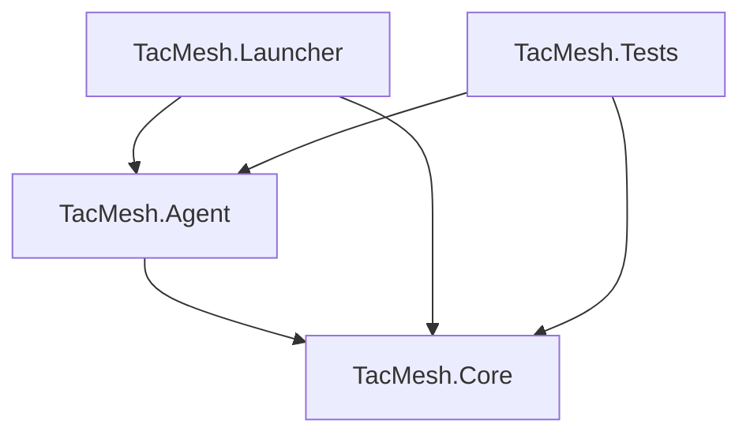

# TACMESH Project Architecture

Project Architecture to mark for every chapter of the proposal, which project and which class will implement it.

## Backend Directories Diagram

**Backend .NET logic**
```text
src
 |-- TacMesh.slnx
 |
 |-- TacMesh.Agent [console. The node process]
 |    |
 |    |-- TacMesh.Agent.csproj
 |    |-- ...
 |
 |-- TacMesh.Core [class library. All the logic lives here]
 |    |
 |    |-- TacMesh.Core.csproj
 |    |-- ...
 |
 |-- TacMesh.Launcher [console. Runs and manages nodes on one machine]
 |    |
 |    |-- TacMesh.Launcher.csproj
 |    |-- ...
 |
 |-- TacMesh.Tests [xUnit. Unit tester]
      |
      |-- TacMesh.Tests.csproj
      |-- ...
```

## Dependency Diagram

In software engineering, Dependency Diagrams are crucial for understanding system architecture.
They help us:

- **Identify bottlenecks**: See if too many components rely on a single fragile service.
- **Prevent circular dependencies**: Ensure Component A doesn't rely on Component B while B also relies on A (which can cause infinite loops).
- **Plan build orders**: Know which modules must be compiled or started first.

In TACMESH the dependencied are:

- **TacMesh.Core** - Indepenent. Why? Because the Core contains all of the backend logic without executing it, it is simply a class library.

- **TacMesh.Agent** - Depends on the Core. Why? Core: Because it executes logic written inside of the Core project.

- **TacMesh.Launcher** - : Depends on TacMesh.Core and TacMesh.Agent. Why? Core: Because it is responsible for launching the logic behind the Core. Agent: Because it is responsible for launching instances of the Agent project.

- **TacMesh.Tests** - Depends on TacMesh.Core and TacMesh.Agent as well. Why? Because it is for unit testing code sample, it get either be Core logic or trying out Agent samples.



## Proposal Chapters Implementation Places

In this next section i'll be explaining the brief resposibility for each project, which chapters from the proposal each project is responsible for handling, and in which class the logic is written in.

**TacMesh.Core** - responsible for the whole logic behind the backend, meaning the whole logic will be written here. Chapters of the  

* Virtual Radio Model
* Seed Generator and Mission-Replay
* Node Processes
* Discovering Neighbours
* Connectivity status and constructing the graph
* Routing, Store-and-Carry
* Logical Clock and Event Ordering
* Storage and Expiration Policy
* End-to-end encryption
* Key derivation and rolling process

**TacMesh.Agent** - responsible for executing Routing messages, Encrypting & Dectypting messages, Calculating Graph State, Storing and Carrying messages, and Forwarding messages:

**TacMesh.Launcher - responsible for launching Agent instances, and killing them to simulate Graph Expansion and Shrinking**:

**TacMesh.Tests** - responsible for Uni-testing Core logic. No

## Functional Requirements Implementation Place

This chart shows where the implementation of the Functional Requirement is going to be implemented at. Not where the actual logic of the
Requirement is written (Where Requirement is implemented != where Requirement logic is written).

```text
   |  Functional Requirement  | Poject (Where executed)  |  Class (Where written)
---+--------------------------+--------------------------+--------------------------
 1 | transmit messages between| Agent (Each user sends   | Messenger (class ftom
   | nodes via multiple hops, | messages and even messages Core)
   | without a central node or| not intended for him)    |
   | external infrastructure  |                          |
---+--------------------------+--------------------------+--------------------------
 2 | A message with no route  | Agent (Stores pending    | 
   | will be stored in the    | messages in a buffer until 
   | node's memory until it   | a fitting connection is  | 
   | expires, and will be     | astablished or TTL ends) |
   | delivered as soon as a   |                          |
   | connection with a suitable                          |
   | node is established      |                          |
---+--------------------------+--------------------------+--------------------------
 3 | Every message will be    | Agent (Encrypts messages | Crypto (class from Core)
   | encrypted and digitally  | before ever sending)     |
   | signed. An forwarding node                          |
   | will not be able to read |                          |
   | the content              |                          |
---+--------------------------+--------------------------+--------------------------
 4 | The system will identify | Agent (Identifies break  | NetAnalyser (class from
   | breaking nodes and bridges points after each        | Core)
   | in the network graph in  | 'connectivity' broadcast | 
   | real time and alert the  | messages and network     |
   | commander                | changes)                 |
---+--------------------------+--------------------------+--------------------------
 5 | Upon receiving a report of  Agent (Executes routing | Router (class from
   | a casualty, the system   | algorithms upon receving | Core)
   | will calculate three     | the report from the UI)  |
   | evacuation routes        |                          |
---+--------------------------+--------------------------+--------------------------
 6 | The system operates fully| All Projects.            | (No single definition)
   | without any central server                          |
---+--------------------------+--------------------------+--------------------------
 7 | The same executable will | All Projects.            | (No single definition)
   | run in two modes without |                          |
   | code changes             |                          |
---+--------------------------+--------------------------+--------------------------
 8 | A scenario created by the| Launcher (Creates data   | MissionPlayer (class in
   | user is saved to a file, | files after every        | Core)
   | Restoring this file      | simulation)              |
   | reproduces the same      |                          |
   | scenario                 |                          |
---+--------------------------+--------------------------+--------------------------
 9 | Each node constructs a   | Agent (Builds Graph)     | GraphCalculator (class from 
   | local estimate of the    |                          | Core)
   | entire network graph based                          |
   | on connectivity records  |                          |
   | distributed across the   |                          |
   | network                  |                          |
---+--------------------------+--------------------------+--------------------------
 10| The Mission Package      | Offline tool.            | (To be Desided.)
   | builder will define users,                          | 
   | roles, and permissions,  |                          |
   | issue the keys, and sign |                          |
   | the package with the     |                          |
   | mission key              |                          |
   |                          |                          |
```