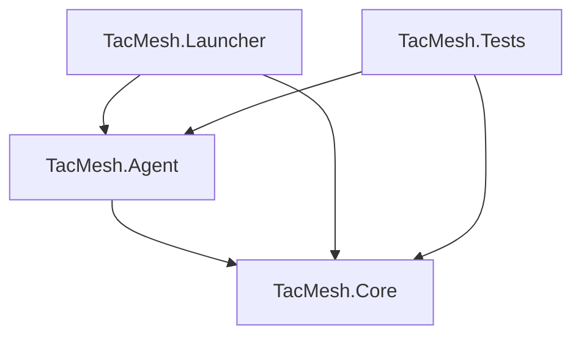

# TACMESH Project Architecture

Project Architecture to mark for every chapter of the proposal, which project and which class will implement it.

## Backend Directories Diagram

**Backend .NET logic**
```text
src
 |-- TacMesh.slnx
 |
 |-- TacMesh.Agent [console. The node process]
 |    |
 |    |-- TacMesh.Agent.csproj
 |    |-- ...
 |
 |-- TacMesh.Core [class library. All the logic lives here]
 |    |
 |    |-- TacMesh.Core.csproj
 |    |-- ...
 |
 |-- TacMesh.Launcher [console. Runs and manages nodes on one machine]
 |    |
 |    |-- TacMesh.Launcher.csproj
 |    |-- ...
 |
 |-- TacMesh.Tests [xUnit. Unit tester]
      |
      |-- TacMesh.Tests.csproj
      |-- ...
```

## Dependency Diagram

In software engineering, Dependency Diagrams are crucial for understanding system architecture.
They help us:

- **Identify bottlenecks**: See if too many components rely on a single fragile service.
- **Prevent circular dependencies**: Ensure Component A doesn't rely on Component B while B also relies on A (which can cause infinite loops).
- **Plan build orders**: Know which modules must be compiled or started first.

In TACMESH the dependencied are:

- **TacMesh.Core** - Indepenent. Why? Because the Core contains all of the backend logic without executing it, it is simply a class library.

- **TacMesh.Agent** - Depends on the Core. Why? Core: Because it executes logic written inside of the Core project.

- **TacMesh.Launcher** - : Depends on TacMesh.Core and TacMesh.Agent. Why? Core: Because it is responsible for launching the logic behind the Core. Agent: Because it is responsible for launching instances of the Agent project.

- **TacMesh.Tests** - Depends on TacMesh.Core and TacMesh.Agent as well. Why? Because it is for unit testing code sample, it get either be Core logic or trying out Agent samples.



## Proposal Chapters Implementation Places

*Proposal Chapters -> Project -> Class (Status)*:

* Execution Architecture -> TacMesh.Core -> ITransport, IRadioModel - Interfaces for different types of executions (Clear)
                         -> TacMesh.Launcher -> AgentManager - kills and starts Agent instances (Clear)

* Node Processes -> TacMesh.Core -> ITransport, HeartBeater, TacReadWriteLock  (Clear)

* Discovering Neighbours -> TacMesh.Core -> NeighbourTable, HeartBeater (Clear)

* Connectivity status and constructing the graph -> TacMesh.Core -> GraphCalculator, ... (Clear + TBD - maybe more classes in the future)

* Routing, Store-and-Carry -> TacMesh.Core -> Router, PacketBuffer, ... (Clear + TBD - maybe more classes in the future)

* End-to-end encryption -> TacMesh.Core -> Crypto (Clear)

* Communication Protocols -> TacMesh.Core -> DataPacket, PacketHeader, PacketHeaderSerializer, PacketBuffer, ITransport, ITransmitter, IReceiver ... (Clear + TBD - maybe more classes in the future)

* Data Base -> TacMesh.Core -> ... (To be decided)

## Functional Requirements Implementation Place

This chart shows where the Functional Requirement is executed and implemented, and a status if *Clear* from planning or going to be *Decided later*.

```text
   |  Functional Requirement  | Where executed           |  Implementaion           | Status
---+--------------------------+--------------------------+--------------------------+--------------
 1 | transmit messages between| Agent (Each user sends   |  --                      | To be decided
   | nodes via multiple hops, | messages and even messages                          |
   | without a central node or| not intended for him)    |                          |
   | external infrastructure  |                          |                          |
---+--------------------------+--------------------------+--------------------------+--------------
 2 | A message with no route  | Agent (Stores pending    | PacketBuffer (class from | Clear
   | will be stored in the    | messages in a buffer until  Core)                   |
   | node's memory until it   | a fitting connection is  |                          |
   | expires, and will be     | astablished or TTL ends) |                          |
   | delivered as soon as a   |                          |                          |
   | connection with a suitable                          |                          |
   | node is established      |                          |                          |
---+--------------------------+--------------------------+--------------------------+--------------
 3 | Every message will be    | Agent (Encrypts messages | Crypto (class from Core) | Clear
   | encrypted and digitally  | before ever sending)     |                          |
   | signed. An forwarding node                          |                          |
   | will not be able to read |                          |                          |
   | the content              |                          |                          |
---+--------------------------+--------------------------+--------------------------+--------------
 4 | The system will identify | Agent (Identifies break  | NetAnalyser (class from  | Clear
   | breaking nodes and bridges points after each        | Core)                    |
   | in the network graph in  | 'connectivity' broadcast |                          |
   | real time and alert the  | messages and network     |                          |
   | commander                | changes)                 |                          |
---+--------------------------+--------------------------+--------------------------+--------------
 5 | Upon receiving a report of  Agent (Executes routing | Router (class from       | Clear
   | a casualty, the system   | algorithms upon receving | Core)                    |
   | will calculate three     | the report from the UI)  |                          |
   | evacuation routes        |                          |                          |
---+--------------------------+--------------------------+--------------------------+--------------
 6 | The system operates fully| All Projects.            | (No single definition)   | Clear
   | without any central server                          |                          |
---+--------------------------+--------------------------+--------------------------+--------------
 7 | The same executable will | All Projects.            | (No single definition)   | Clear
   | run in two modes without |                          |                          |
   | code changes             |                          |                          |
---+--------------------------+--------------------------+--------------------------+--------------
 8 | A scenario created by the|  --                      |  --                      | To be decided
   | user is saved to a file, |                          |                          |
   | Restoring this file      |                          |                          |
   | reproduces the same      |                          |                          |
   | scenario                 |                          |                          |
---+--------------------------+--------------------------+--------------------------+--------------
 9 | Each node constructs a   | Agent (Builds Graph)     | GraphCalculator (class   | Clear
   | local estimate of the    |                          | from Core)               |
   | entire network graph based                          |                          |
   | on connectivity records  |                          |                          |
   | distributed across the   |                          |                          |
   | network                  |                          |                          |
---+--------------------------+--------------------------+--------------------------+--------------
 10| The Mission Package      | Offline tool.            |  --                      | To be decided
   | builder will define users,                          |                          |
   | roles, and permissions,  |                          |                          |
   | issue the keys, and sign |                          |                          |
   | the package with the     |                          |                          |
   | mission key              |                          |                          |
   |                          |                          |                          |
```